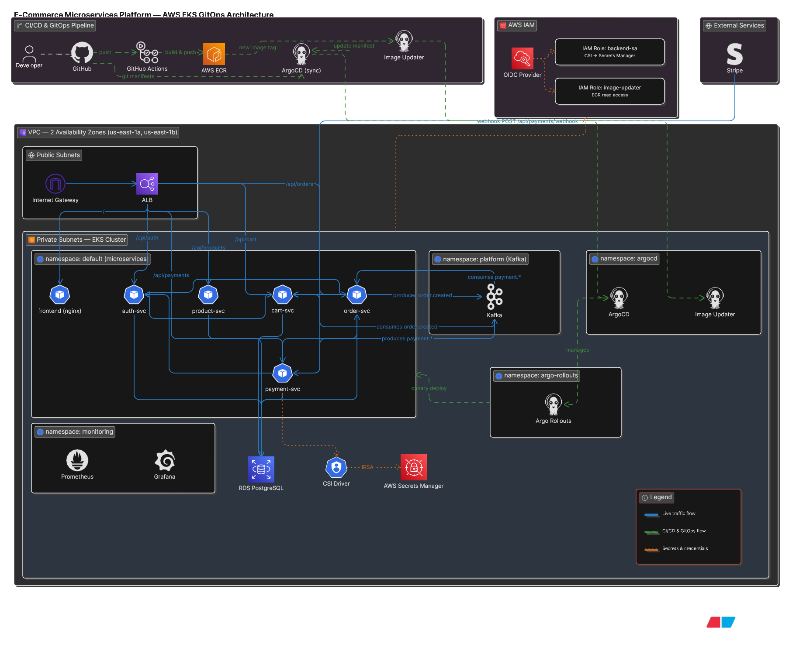
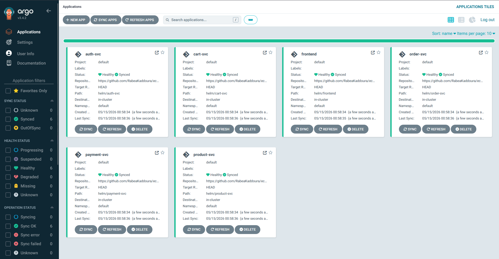
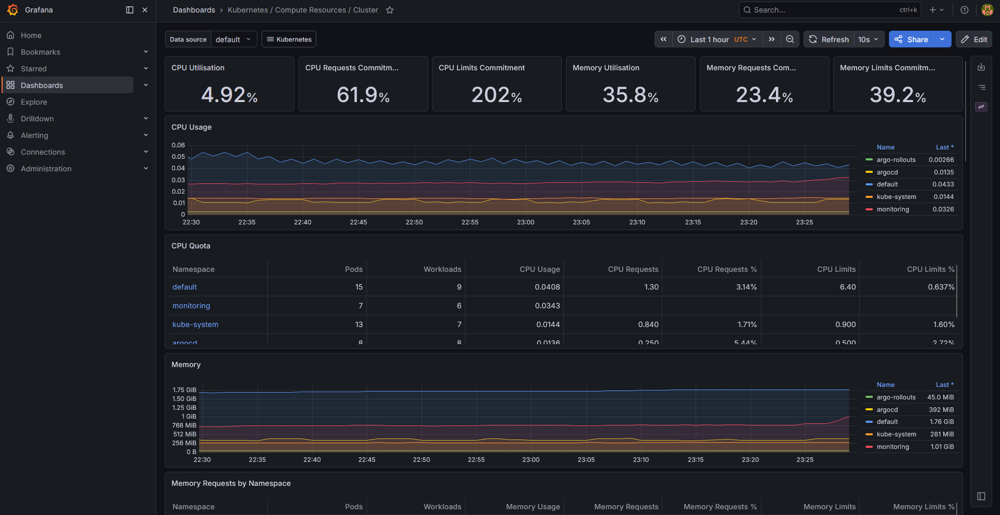

# 3-Tier GitOps E-Commerce Microservices Platform

A full-stack e-commerce platform built with a microservices architecture and deployed on AWS EKS using a complete GitOps workflow.

This project focuses on Kubernetes, CI/CD automation, GitOps deployments, event-driven communication, secure secret management, and production-style troubleshooting across distributed systems.

---

# 📌 Table of Contents

- [Architecture Diagram](#-architecture-diagram)
- [Tech Stack](#-tech-stack)
- [Architecture](#-architecture)
- [GitOps Workflow](#-gitops-workflow)
- [AWS Network & High Availability Design](#-aws-network--high-availability-design)
- [Security](#-security)
- [Monitoring](#-monitoring)
- [Troubleshooting & Real-World Issues](#-troubleshooting--real-world-issues)
- [Screenshots](#-screenshots)
- [Documentation](#-documentation)
- [Future Improvements](#-future-improvements)

---

# 📐 Architecture Diagram

---

# 🧰 Tech Stack

## 🖥️ Backend

* FastAPI
* Tortoise ORM
* PostgreSQL
* Kafka (Strimzi)
* Stripe

## 🎨 Frontend

* React
* TypeScript
* Vite
* TailwindCSS

## ☁️ Infrastructure & DevOps

* AWS EKS
* AWS RDS PostgreSQL
* AWS ECR
* AWS ALB Ingress Controller
* AWS Secrets Manager
* Terraform
* Helm
* ArgoCD
* Argo Rollouts
* ArgoCD Image Updater
* Prometheus
* Grafana

---

# 🏗️ Architecture

The platform consists of 5 backend microservices:

* auth-svc
* cart-svc
* order-svc
* product-svc
* payment-svc

Services communicate through:

* Kubernetes internal networking
* Kafka event streaming

### 📡 Kafka Topics

* order.created
* payment.succeeded
* payment.failed

### 🔁 Example Flow

* order-svc → publishes `order.created`
* cart-svc → consumes event and clears cart
* payment-svc → publishes payment result
* order-svc → updates order status

Each service uses its own PostgreSQL database hosted on a shared AWS RDS instance.

---

# 🔄 GitOps Workflow

1. Code pushed to GitHub
2. GitHub Actions builds Docker images
3. Images pushed to AWS ECR
4. ArgoCD Image Updater detects new image tags
5. Updated tags committed back to Git
6. ArgoCD syncs Helm charts
7. Argo Rollouts performs canary deployments

### 🚦 Deployment Strategy

* 10% traffic
* 50% manual promotion
* 100% rollout

---

## 🌐 AWS Network & High Availability Design

The infrastructure is deployed across:

- 2 Availability Zones (Multi-AZ setup)

- Public Subnets
  - Used for AWS Application Load Balancer (ALB)
  - Internet-facing entry point for frontend/API traffic

- Private Subnets
  - EKS worker nodes run here
  - Backend microservices are not directly exposed to the internet
  - AWS RDS PostgreSQL is deployed in private subnets

This ensures:

- High availability across multiple AZs
- Fault tolerance if one AZ fails
- Secure isolation of backend workloads

---

# 🔐 Security

Security is enforced across infrastructure, network, and application layers.

## 🗝️ Secrets Management

* AWS Secrets Manager stores all sensitive credentials
* CSI Secrets Store Driver injects secrets into pods
* IAM Roles for Service Accounts (IRSA)
* No secrets stored in Git or Helm values

---

## 🌐 Network Security

* AWS Security Groups control traffic flow:

  * EKS nodes allow only required traffic
  * RDS only accessible from EKS worker nodes
  * ALB exposed publicly for frontend/API access
* Kubernetes services use ClusterIP for internal-only communication

---

## 🧑‍💻 IAM & Access Control

* Least-privilege IAM roles per service
* IRSA eliminates static AWS credentials in pods
* Terraform manages IAM policies consistently

---

## ⚙️ Kubernetes Security

* Dedicated service accounts per microservice
* Namespace isolation for workload separation
* No privileged containers
* No hardcoded secrets in manifests

---

## 📦 Container Security

* Images stored in AWS ECR
* Versioned tags (no latest in production)
* CI pipeline ensures reproducible builds

---

# 📊 Monitoring

* Prometheus
* Grafana

Used for:

* Cluster health
* Pod metrics
* Deployment debugging
* System observability

---

# 🧯 Troubleshooting & Real-World Issues

This project includes real production-style failures and debugging scenarios.

## ⚠️ ALB Namespace Issue

ALB failed to route traffic after separating services into different namespaces.

Diagnosis:
* Checked ALB target group health in AWS console — targets showed unhealthy
* Inspected ingress events with `kubectl describe ingress` — controller could not find backend services

Fix:
* Reverted all services to the default namespace — ALB Ingress Controller requires the Ingress and all backend services to be in the same namespace

---

## ⚠️ ArgoCD Degraded Applications

ArgoCD marked services as degraded immediately after sync.

Diagnosis:
* Read ArgoCD sync error logs — showed Helm template rendering failure
* Error pointed to `required` function failing on `appSecrets.secretKey` — value was empty string in values.yaml

Fix:
* Removed sensitive values from Helm entirely
* Migrated all secrets to AWS Secrets Manager, injected via CSI Driver

---

## ⚠️ ArgoCD Image Updater Migration

Image Updater stopped detecting new ECR images after reinstall.

Diagnosis:
* Checked Image Updater logs — showed `No ImageUpdater CRs to process`
* Discovered v1.2.0 dropped annotation-based configuration entirely

Fix:
* Migrated to CRD-based `ImageUpdater` custom resources per service with `allowTags` regex filters

---

## ⚠️ Kafka Image Pull Failure

Kafka pods stuck in `ImagePullBackOff`.

Diagnosis:
* Described failing pods — error showed `docker.io/bitnami/kafka: not found`
* Bitnami moved all images behind a paid subscription

Fix:
* Switched to Strimzi operator with official Apache Kafka images
* Updated Kafka version to 4.0 (KRaft mode, no Zookeeper)

---

## ⚠️ Database Port Type Error

All backend services crashing on startup with `ConfigurationError: Port is not an integer`.

Diagnosis:
* Checked pod logs with `kubectl logs` — Tortoise ORM threw exception on DB URL construction
* Port value stored in Secrets Manager as JSON string `"5432"` not integer

Fix:
* Wrapped `os.getenv("DB_PORT")` in `int()` in all service database session files

---

## ⚠️ IRSA Misconfiguration

Pods failing to mount secrets with `AccessDenied: Not authorized to perform sts:AssumeRoleWithWebIdentity`.

Diagnosis:
* Checked pod events with `kubectl describe pod` — FailedMount error with full IAM error
* Inspected IAM role trust policy — referenced the wrong one

Fix:
* Updated trust policy via AWS CLI immediately
* Fixed namespace in Terraform to prevent recurrence on next apply

---

# 🖼️ Screenshots

## 🧭 ArgoCD Dashboard

---

## 📈 Grafana Dashboard

---

# 📚 Documentation

Operational setup and deployment steps:

* Runbook → `docs/runbook.md`

---

# 🚧 Future Improvements

* API Gateway integration
* Redis caching layer
* Distributed tracing
* Performance optimization
* Observability upgrades
